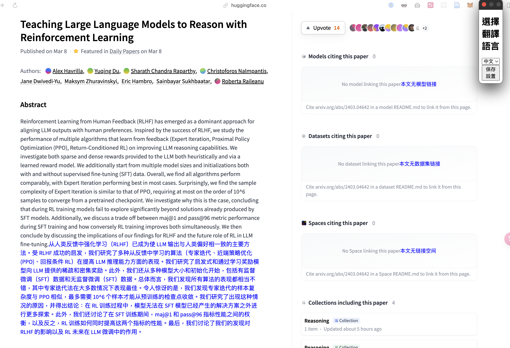

# 網頁翻譯Chrome擴展



## 描述

這個Chrome擴展提供了一種簡單高效的網頁文本內容翻譯方式。通過使用強大的DeepL API，它使用戶能夠選擇文本並直接在瀏覽器中將其翻譯成多種語言，包括英語、德語和中文。

## 特性

- 只需點擊即可在任何網頁上翻譯文本。
- 支持多種語言：英語、德語、中文等。
- 易於使用的彈出介面用於選擇目標翻譯語言。
- 利用DeepL API進行準確自然的翻譯。

## 安裝

1. 從GitHub克隆代碼庫到本地機器。打開終端或命令提示符，執行以下命令：

```sh
git clone https://github.com/your-repository-url.git
```

請將`your-repository-url.git`替換為您項目的實際GitHub倉庫URL。

2. 打開Chrome瀏覽器，並在地址欄輸入`chrome://extensions`，進入擴展程式頁面。

3. 在頁面右上角，開啟"開發者模式"開關。

4. 點擊"加載已解壓的擴展程式"按鈕，從您的檔案系統中選擇克隆的項目資料夾。

5. 擴展現在應該已經加載到您的Chrome瀏覽器中，並在擴展列表中顯示。

## 使用方法

安裝後，導航到任何網頁並點擊瀏覽器工具欄中的擴展圖標。從彈出菜單中選擇目標翻譯語言，然後將滑鼠懸停或選擇您希望翻譯的文本。翻譯後的文本將顯示在工具提示或內聯彈出窗口中。

## 提醒

在使用此擴展進行翻譯之前，請確保將`background/background.js`檔案中的`API_KEY`替換為您的DeepL API密鑰。

## 貢獻

歡迎對本項目進行貢獻！如果您有改進的建議或遇到任何問題，請在GitHub上開一個issue或提交一個pull request。

## 許可證

本項目根據MIT許可證授權 - 詳情見[LICENSE](LICENSE)檔案。
